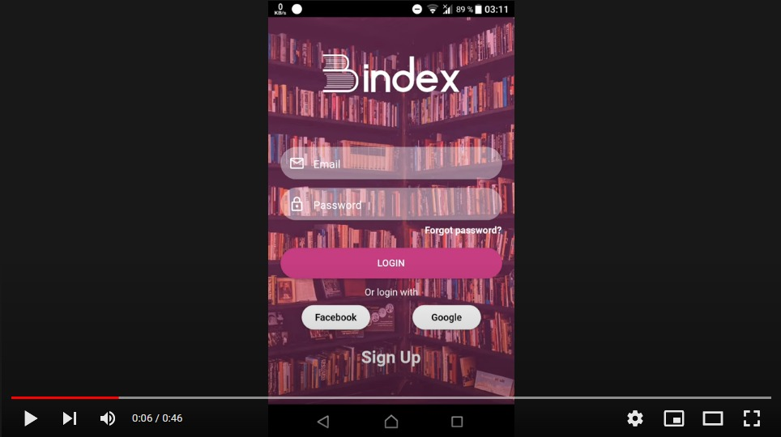
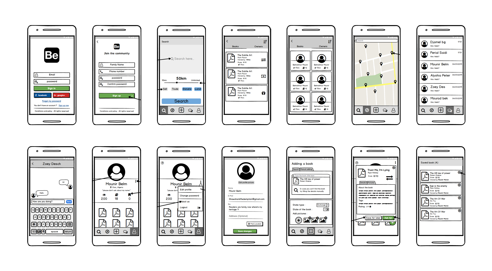
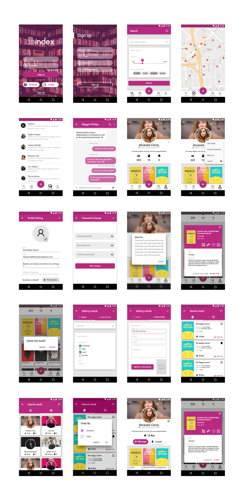

# Bindex

## Description
Bindex is a social media mobile app, where users can exchange, sell, lend or buy papar books, also form meaningful connections with fellow readers

## Demo (in progress)

[

](https://youtu.be/QVt_tlIFg9Q)

## Wireframe

## UI Design

## App structure

| Folder     |      Purpose  |
|------------|:--------------|
| components |  Parts of the UI that are used more than once accros the app |
| models     |  folder where data defining models are located |
| services   |  classes that handle the business logic and expose ready to use services (eg authentication)     |
| views      | Different declarative UI views |